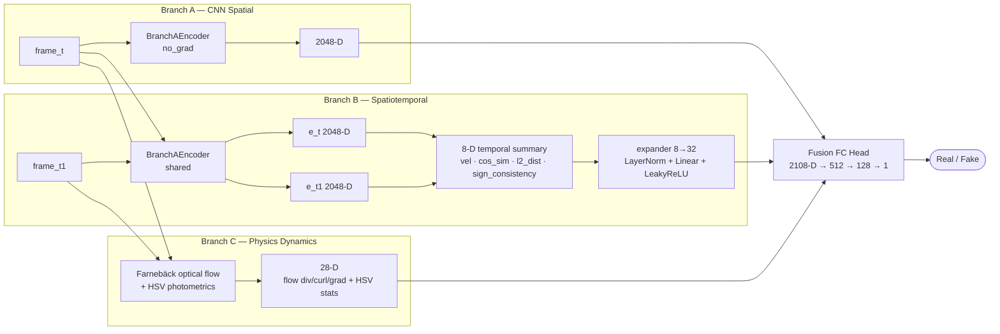
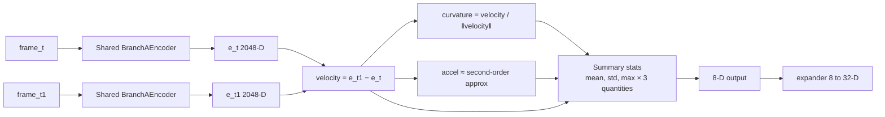
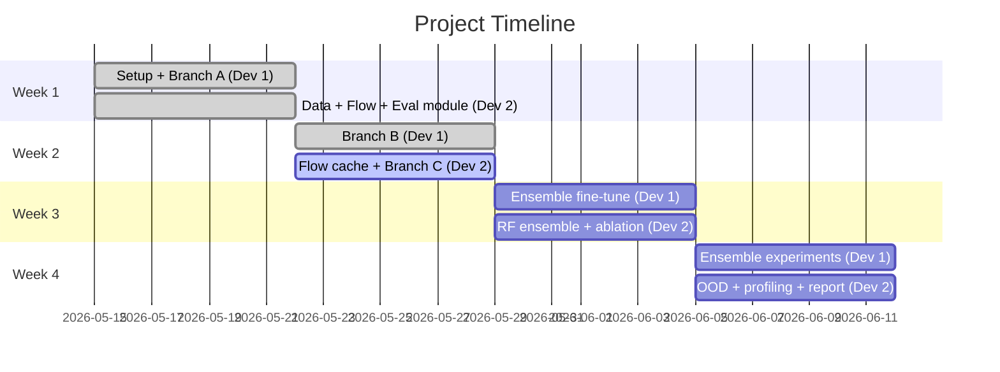
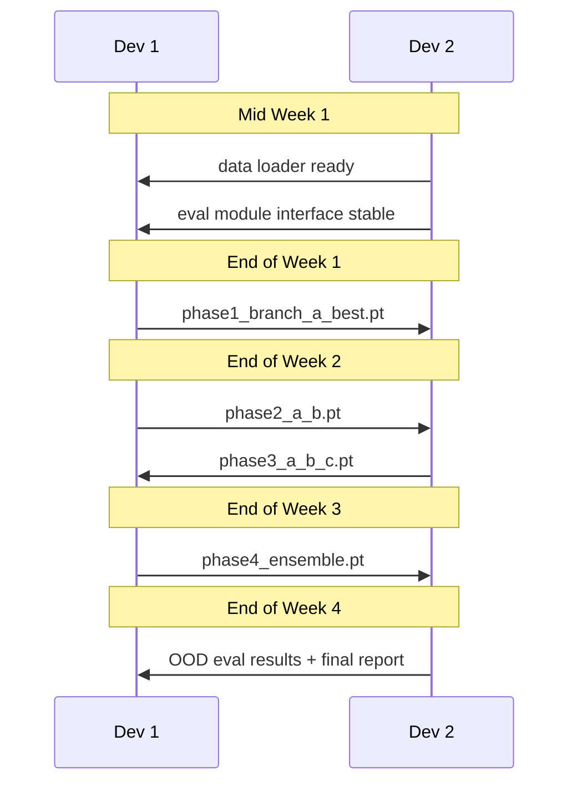

# Hybrid Three-Branch GAN Discriminator — Master Plan

> Deepfake Face Detection · Based on Barrington & Farid, CVPR Workshop 2026  
> Dataset: CelebA (202,599 images) via Kaggle `jessicali9530/celeba-dataset`
>
> Doc basis: refreshed on 2026-05-26 from the project proposal and current repository state

---

## Table of Contents

1. [Project Overview](#1-project-overview)
2. [Architecture](#2-architecture)
3. [Build Plan](#3-build-plan)
4. [Team & Task Split](#4-team--task-split)
5. [File & Module Structure](#5-file--module-structure)
6. [Data Pipeline](#6-data-pipeline)
7. [Training Strategy (4 Phases)](#7-training-strategy-4-phases)
8. [Loss Functions](#8-loss-functions)
9. [Evaluation & Metrics](#9-evaluation--metrics)
10. [Expected Performance Targets](#10-expected-performance-targets)
11. [Risks & Mitigations](#11-risks--mitigations)
12. [Dependencies](#12-dependencies)

---

## 1. Project Overview

### Problem

Standard single-branch GAN discriminators achieve 95%+ accuracy on in-distribution content but **collapse to ~52% accuracy** when encountering novel generation methods (style transfer, reenactment, diffusion-based synthesis). The goal is to recover accuracy above **94% on out-of-domain content**.

### Solution

A **hybrid three-branch discriminator** that captures orthogonal signals:

| Branch               | Signal Type                            | Why It Helps                                                     |
| -------------------- | -------------------------------------- | ---------------------------------------------------------------- |
| A — CNN Spatial      | Static frame-level texture & structure | Strong in-domain baseline                                        |
| B — Spatiotemporal   | Temporal embedding velocity/curvature  | Catches lip-sync deepfakes, expression swaps                     |
| C — Physics Dynamics | Optical flow + HSV photometrics        | Catches skin flicker, implausible flow, color temperature shifts |

**Key result from proposal:** B + C ensemble → **94.4% balanced accuracy, F1 = 0.93** (vs. 52% baseline on OOD content).

### Repository reality check

The proposal is the target design, not the current implementation state.

- Implemented now: Branch A baseline, Branch B temporal summary branch, Branch C physics branch, Phase 2 and Phase 3 training paths, CelebA pair loader, offline flow precompute, checkpoint helpers, and evaluation metrics/plots
- Not implemented now: Phase 4 fine-tuning, random-forest ensemble experiments, OOD evaluation, and proposal-parity three-branch fine-tuning
- Important delta: the current Phase 2/3 code expands Branch B's proposal-level `8-D` summary into a learned `32-D` feature before fusion, so the implemented three-branch head is `2048 + 32 + 28 = 2108`, not the proposal's final `2084-D` fusion contract

---

## 2. Architecture

### 2.1 High-Level Diagram



### 2.2 Branch A — CNN Spatial Features

Operates on a **single 64×64×3 frame**. Five convolutional blocks with SpectralNorm + BatchNorm.

| Layer   | Operation                      | Output Shape | Norm                           |
| ------- | ------------------------------ | ------------ | ------------------------------ |
| Input   | —                              | 64×64×3      | —                              |
| Conv 1  | Conv2d(3→64, k=4, s=2, p=1)    | 32×32×64     | None (no BN on first layer)    |
| Conv 2  | Conv2d(64→128, k=4, s=2, p=1)  | 16×16×128    | SpectralNorm + BN              |
| Conv 3  | Conv2d(128→256, k=4, s=2, p=1) | 8×8×256      | SpectralNorm + BN              |
| Conv 4  | Conv2d(256→512, k=4, s=2, p=1) | 4×4×512      | SpectralNorm + BN              |
| Conv 5  | Conv2d(512→512, k=4, s=2, p=1) | 2×2×512      | SpectralNorm (no BN before FC) |
| Flatten | 2×2×512 → vector               | **2048-D**   | —                              |

Activation: **LeakyReLU(0.2)** throughout.

### 2.3 Branch B — Spatiotemporal Embedding Derivatives

Operates on a **consecutive frame pair**. The proposal describes a compact embedding CNN, while the current implementation reuses the pretrained `BranchAEncoder` and computes summary statistics in that shared feature space.



**What it catches:** Lip-sync deepfakes, expression swaps, discontinuous feature trajectories.

### 2.4 Branch C — Physics-Based Dynamics

Accepts either **pre-computed features** (offline, recommended for speed) or **raw frame pairs**.

```
Optical flow (div / curl / grad)     → 20-D
HSV photometrics (h, s, v mean/std)  →  8-D
─────────────────────────────────────────────
Total                                → 28-D
```

**What it catches:** Skin tone flicker, implausible optical flow patterns, color temperature inconsistencies.

> **Note:** For production, pre-compute optical flow offline using Farnebäck (OpenCV) and cache as `.pt` tensors alongside each image. This avoids flow computation bottleneck during training.

### 2.5 Fusion Head

| Contract | Layer    | In → Out   | Activation                       |
| -------- | -------- | ---------- | -------------------------------- |
| Proposal | Linear 1 | 2084 → 512 | LeakyReLU(0.2) + Dropout(0.3)    |
| Current  | Linear 1 | 2108 → 512 | LeakyReLU(0.2) + Dropout(0.3)    |
| Both     | Linear 2 | 512 → 128  | LeakyReLU(0.2)                   |
| Both     | Linear 3 | 128 → 1    | — (logits; sigmoid at inference) |

### 2.6 Phase-by-phase tensor contracts

This section keeps the proposal contract and the current code path separate.

| Stage                           | Tensor contract                             | Status                                 |
| ------------------------------- | ------------------------------------------- | -------------------------------------- |
| Proposal Branch A encoder       | `2048-D` per frame                          | Implemented                            |
| Proposal Branch B summary       | `8-D` per frame pair                        | Implemented as an intermediate summary |
| Current Phase 2 Branch B output | `32-D` learned expansion of the 8-D summary | Implemented                            |
| Proposal Branch C output        | `28-D` per frame pair                       | Implemented                            |
| Proposal final fusion           | `2048 + 8 + 28 = 2084-D`                    | Not implemented                        |
| Current Phase 2 fusion          | `2048 + 32 = 2080-D`                        | Implemented                            |
| Current Phase 3 fusion          | `2048 + 32 + 28 = 2108-D`                   | Implemented                            |

---

## 3. Build Plan

### Project Checkpoint — 2026-05-26

Current status from the repository state:

- **Week 1 is substantially complete.** The local CelebA tree is present at `data/celeba/img_align_celeba` with **202,599 images**, the Week 1 data pipeline and tests exist, and the Branch A baseline has already produced `checkpoints/phase1_branch_a_best.pt`.
- **Branch A checkpoint is real and measurable.** `runs/branch_a_baseline/benchmark_summary.json` reports best validation metrics of **1.0000 balanced accuracy** and **1.0000 F1** at epoch **34**, which clears the Week 1 gate.
- **Known checkpoint limitation remains.** The recorded Branch A and Phase 2 runs were produced before the loader switched fake sampling away from noise duplicates, so those metrics are only useful as architecture smoke tests, not meaningful proxy-task scores.
- **Farnebäck cache is already complete on this machine.** Verified on **2026-05-18**: `data/flow_cache` contains **202,599** `*_flow.pt` files with **0 missing / 0 extra** stems against `discover_celeba_images`, sample tensors have shape `(2, 64, 64)` and `float32` dtype, the cache occupies about **7.0 GB**, and `tests.test_data.DataPipelineTestCase.test_flow_precompute_smoke` passes.
- **Week 2 Branch C must preserve the cache contract.** Cached flow filenames are `{frame_a_stem}_flow.pt`, and each tensor is computed against the adjacent-index partner rule used by `data/precompute_flow.py`. The loader now uses cross-identity proxy negatives when identity labels are available, so Branch C must either stay on explicit adjacent-index pairing or use a regenerated cache that matches the new pair selection rule before training.
- **Week 2 Dev 1 code is now in place.** `models/branch_b.py`, `models/discriminator.py`, `training/phase2_trainer.py`, `training/phase2_train.py`, and `tests/test_model.py` now exist. Branch B's proposal-level 8-D layout and acceleration proxy are locked by a golden regression test, and the current implementation expands that summary to a learned 32-D feature before Phase 2 fusion. Phase 2 also includes a real Branch A freeze test plus Phase 1 encoder load/remap coverage.
- **Current training runs now use guarded stopping.** Branch A and Phase 2 trainers stop early when validation loss shows sustained overfitting, and each phase also has a branch-specific validation-loss ceiling after warmup.
- **Phase 2 is gate-cleared.** `checkpoints/phase2_a_b.pt` now exists with `phase == 2`; the saved checkpoint reports best validation metrics of **1.0000 balanced accuracy** and **1.0000 F1** at epoch **2**, and `runs/phase2_a_b/benchmark_summary.json` matches those values.
- **Week 2 Dev 2 training is now complete.** `checkpoints/phase3_a_b_c.pt` exists and matches `runs/phase3_a_b_c_w2/benchmark_summary.json`. The best validation result occurs at epoch **8** with **0.8741 balanced accuracy**, **0.9067 F1**, **0.9484 AUC-ROC**, and **0.2726 loss**, which clears the configured Phase 3 gate.
- **Week 3 is now unblocked.** Phase 4, ensemble training, and OOD evaluation are still not implemented. The main remaining architectural decision is whether later phases should preserve the current learned 32-D Branch B expansion or collapse back to the proposal's direct 8-D fusion contract.

### Milestones



> **Compression rationale:** Setup and Branch A are merged into Week 1 by running data pipeline work (Dev 2) in parallel with scaffold + model work (Dev 1). Branches B and C are built in parallel in Week 2 since they are independent of each other. Eval is tightened to one week by preparing the eval harness during Week 3 alongside training.

### Week 1 — Setup + Branch A

- [x] Download CelebA from Kaggle (`img_align_celeba.zip`, ~2 GB)
- [x] Validate dataset: count images, verify resolution (178×218)
- [x] Write `CelebAFramePairDataset` with identity-based pair sampling
- [x] Write unit tests for data loader: shape checks, label balance, no NaN
- [x] **Start** Farnebäck optical flow pre-computation (background job, completes mid-week)
- [x] Set up experiment tracking (TensorBoard or W&B)
- [x] Write `config.yaml` with all hyperparameters
- [x] Implement `BranchA_CNN` + `DiscriminatorPhase1`
- [x] Train Branch A end-to-end on CelebA proxy real/fake pairs
- [x] Target: ≥77% balanced accuracy; save `checkpoints/phase1_branch_a.pt`

### Week 2 — Branches B & C (parallel)

- [x] **Dev 1:** Implement `BranchB_Spatiotemporal` + `DiscriminatorPhase2` (Branch A frozen); smoke-verify load/freeze/tests and Phase 2 training path
- [x] **Dev 1:** Run the full Phase 2 training job; target ≥88% accuracy; save `checkpoints/phase2_a_b.pt`
- [x] **Dev 2:** Run the full Branch C / Phase 3 training job with A+B frozen; target ≥83% accuracy; save `checkpoints/phase3_a_b_c.pt`
- [x] **Dev 2:** Finalize flow cache `.pt` files; implement `BranchC_Physics`; implement Hinge loss
- [x] **Dev 2:** Build balanced accuracy / F1 / AUC-ROC eval module; checkpoint save/resume

### Week 3 — Full Ensemble Fine-tune

- [ ] Dev 1: Unfreeze all branches, fine-tune end-to-end with lower LR (5e-5)
- [ ] Dev 1: Train independent random forest classifiers per branch pair (B+C recommended)
- [ ] Dev 1: Run all 7 ensemble combination experiments
- [ ] Target: **B+C ensemble ≥ 94.4% balanced accuracy, F1 ≥ 0.93**
- [ ] Save `checkpoints/phase4_ensemble.pt`
- [ ] Dev 2: Finalize confusion matrix + per-branch ablation module in parallel

### Week 4 — Eval & Hardening

- [ ] Evaluate on out-of-distribution test sets (style transfer, diffusion-generated faces)
- [ ] Run full ablation: each branch independently, all pairs, full triple
- [ ] Profile inference time; optimize Branch C flow pre-computation
- [ ] Write final eval report

---

## 4. Team & Task Split

Two developers, four weeks, split by model vs. data/eval ownership.

> **Merge rationale:** With two people, training and evaluation responsibilities (previously Dev 3) are absorbed into Dev 1 and Dev 2 respectively. Branch B and C are trained sequentially rather than in parallel — Dev 1 handles Branch B while Dev 2 handles Branch C in the same week, which is still achievable since they don't share code. Dev 2 absorbs all evaluation and reporting work previously owned by Dev 3.

### Roles

| Developer | Role                       | Primary Ownership                                                                            |
| --------- | -------------------------- | -------------------------------------------------------------------------------------------- |
| Dev 1     | Model & training           | `models/`, `training/` — all three branches, training scripts, ensemble fine-tune            |
| Dev 2     | Data, physics & evaluation | `data/`, `evaluation/` — CelebA loader, flow cache, Branch C training, OOD eval, all reports |

### Per-Developer Task Breakdown

**Dev 1 — Model & training**

| Week | Tasks                                                                                                                                                                                                                    |
| ---- | ------------------------------------------------------------------------------------------------------------------------------------------------------------------------------------------------------------------------ |
| 1    | Project scaffold, `config.yaml`, requirements, experiment tracking setup; `BranchA_CNN` + `DiscriminatorPhase1`; core training loop (`trainer.py`), BCE loss; unit tests; train Branch A; save `phase1_branch_a_best.pt` |
| 2    | `BranchB_Spatiotemporal` + `DiscriminatorPhase2` (Branch A frozen); Phase 2 training script; full-gate Branch B training complete; `phase2_a_b.pt` ready for Dev 2 consumption                                           |
| 3    | Full ensemble fine-tune, unfreeze all branches, BCE + Hinge combined loss tuning; save `phase4_ensemble.pt`                                                                                                              |
| 4    | All 7 ensemble combination experiments; architecture review; support OOD eval                                                                                                                                            |

**Dev 2 — Data, physics & evaluation**

| Week | Tasks                                                                                                                                                                                                                             |
| ---- | --------------------------------------------------------------------------------------------------------------------------------------------------------------------------------------------------------------------------------- |
| 1    | CelebA validation (data already present locally); `CelebAFramePairDataset` + augmentation pipeline + data loader unit tests; **launch** Farnebäck flow pre-computation (background); balanced accuracy / F1 / AUC-ROC eval module |
| 2    | Finalize flow cache `.pt` files; `BranchC_Physics`; Phase 3 training script (A+B frozen); train Branch C; save `phase3_a_b_c.pt`; Hinge loss implementation                                                                       |
| 3    | Random forest ensemble (B+C, A+B, A+C, A+B+C); confusion matrix + per-branch ablation module; checkpoint save/resume                                                                                                              |
| 4    | OOD eval sets (style transfer, diffusion faces); inference profiling; flow pre-compute optimization; final eval report                                                                                                            |

### 4-Week Timeline

| Team  | Week 1                      | Week 2                | Week 3                 | Week 4                   |
| ----- | --------------------------- | --------------------- | ---------------------- | ------------------------ |
| Dev 1 | Scaffold + Branch A + Train | Branch B              | Ensemble fine-tune     | Ensemble experiments     |
| Dev 2 | Data + flow + eval module   | Flow cache + Branch C | RF ensemble + ablation | OOD + profiling + report |

### Critical Sync Points



---

## 5. File & Module Structure

```
deepfake_detector/
│
├── config/
│   └── config.yaml                  # All hyperparameters
│
├── data/
│   ├── celeba_loader.py             # CelebAFramePairDataset + DataLoader factory
│   ├── precompute_flow.py           # Farnebäck flow pre-computation script
│   └── augmentations.py             # Shared transforms
│
├── models/
│   ├── discriminator.py             # HybridDiscriminator + all branches
│   ├── branch_a.py                  # BranchA_CNN (can be split out)
│   ├── branch_b.py                  # BranchB_Spatiotemporal
│   └── branch_c.py                  # BranchC_Physics
│
├── training/
│   ├── trainer.py                   # Main training loop
│   ├── losses.py                    # BCE + Hinge loss implementations
│   ├── phase1_train.py              # Branch A only
│   ├── phase2_train.py              # A + B (frozen A)
│   ├── phase3_train.py              # A + B + C (frozen A, B)
│   └── phase4_finetune.py           # Full ensemble fine-tune
│
├── evaluation/
│   ├── eval.py                      # Balanced accuracy, F1, confusion matrix
│   ├── ensemble.py                  # Random forest ensemble over branch outputs
│   └── ood_eval.py                  # Out-of-domain evaluation
│
├── checkpoints/                     # Saved model weights (gitignored)
│
├── runs/                            # TensorBoard logs (gitignored)
│
├── scripts/
│   └── download_celeba.sh           # Kaggle API download helper
│
├── tests/
│   ├── test_model.py                # Shape/forward-pass unit tests
│   └── test_data.py                 # Data loader unit tests
│
├── requirements.txt
└── README.md
```

---

## 6. Data Pipeline

### Dataset Facts (CelebA)

| Property          | Value                        |
| ----------------- | ---------------------------- |
| Total images      | 202,599                      |
| Identities        | 10,177                       |
| Native resolution | 178×218                      |
| Target resolution | 64×64                        |
| Attributes        | 40 binary labels per image   |
| License           | Non-commercial research only |

### Split

| Split | Image Range       | Count   |
| ----- | ----------------- | ------- |
| Train | 1 – 162,770       | 162,770 |
| Val   | 162,771 – 182,637 | 19,867  |
| Test  | 182,638 – 202,599 | 19,962  |

### Frame Pair Sampling Strategy

```
Real pair:   two images of the same celebrity identity
             (simulate consecutive frames of authentic video)

Legacy proxy: single image + small Gaussian noise duplicate
              used by earlier historical checkpoints only

Current proxy: anchor image + different-identity image when labels exist
               fallback to distant-index pairing without identity labels
               pseudo-identity file may be derived from stable CelebA attributes if true identities are unavailable
               → replace with GAN/diffusion outputs during full deepfake training
```

### Augmentations (train only)

- Random horizontal flip
- ColorJitter (brightness ±0.1, contrast ±0.1, saturation ±0.05)
- Normalize to [-1, 1]

### Optical Flow Pre-computation

```bash
python data/precompute_flow.py \
  --img-dir /data/celeba/img_align_celeba \
  --out-dir /data/celeba/flow_cache \
  --method farneback
```

Cached as `{image_stem}_flow.pt` → shape `(2, 64, 64)` (dx, dy channels).

---

## 7. Training Strategy (4 Phases)

### Phased Approach Rationale

Training all branches simultaneously from scratch leads to unstable gradients and branch co-adaptation. The phased freeze strategy ensures each branch learns strong independent features before the fusion head is trained.

### Hyperparameters

| Parameter              | Value                   |
| ---------------------- | ----------------------- |
| Image size             | 64×64                   |
| Batch size             | 64                      |
| Optimizer              | Adam (β₁=0.5, β₂=0.999) |
| LR (phases 1–3)        | 2e-4                    |
| LR (phase 4 fine-tune) | 5e-5                    |
| Epochs per phase       | 20                      |
| Scheduler              | CosineAnnealingLR       |
| Dropout (fusion head)  | 0.3                     |
| Fake ratio             | 0.5 (balanced)          |

### Phase Summary

| Phase | Trainable Parameters               | Frozen           | Target Metric        |
| ----- | ---------------------------------- | ---------------- | -------------------- |
| 1     | Branch A baseline + FC             | —                | Acc ≥ 77%, F1 ≥ 0.70 |
| 2     | Branch B + A+B fusion head         | Branch A encoder | Acc ≥ 88%, F1 ≥ 0.88 |
| 3     | Branch C + A+B+C fusion head       | Branch A, B      | Acc ≥ 83%, F1 ≥ 0.80 |
| 4     | Full fused model or ensemble stack | —                | Acc ≥ 94%, F1 ≥ 0.93 |

---

## 8. Loss Functions

### Primary — Binary Cross-Entropy

```
L_BCE = −[ y · log D(x) + (1 − y) · log(1 − D(G(z))) ]
```

Simple, interpretable. Used for all phased training.

### Stability — Hinge Loss

```
L_hinge = E[max(0, 1 − D(x))] + E[max(0, 1 + D(G(z)))]
```

Enforces a margin between real and fake predictions. Used during Phase 4 fine-tuning.

### Combined (Phase 4)

```
L_total = α · L_BCE + (1 − α) · L_hinge      α = 0.7
```

---

## 9. Evaluation & Metrics

### Metrics

| Metric            | Description                                      |
| ----------------- | ------------------------------------------------ |
| Balanced Accuracy | Average of TPR and TNR — handles class imbalance |
| F1 Score          | Harmonic mean of precision and recall            |
| AUC-ROC           | Area under ROC curve                             |
| Confusion Matrix  | Per-class breakdown: authentic vs. synthetic     |

### Ensemble Strategy

For the B+C ensemble (recommended per proposal):

1. Train Branch B and Branch C independently to convergence
2. Extract their output logits or summary outputs as features
3. Fit a **Random Forest classifier** on [B_logit, C_logit] → real/fake
4. Optionally stack with Branch A logit for the full A+B+C ensemble

### Out-of-Domain Test Sets

To validate OOD robustness, evaluate on:

- Style-transferred faces (neural style transfer)
- Face reenactment (e.g. First Order Motion Model outputs)
- Diffusion-based face synthesis (e.g. Stable Diffusion inpainting)

---

## 10. Expected Performance Targets

| Configuration                    | Authentic % | Synthetic % | F1       | Notes                |
| -------------------------------- | ----------- | ----------- | -------- | -------------------- |
| Branch A only (CNN baseline)     | 77.8%       | 77.8%       | 0.70     | Phase 1 gate         |
| Branch B only (spatiotemporal)   | 88.9%       | 94.4%       | 0.91     |                      |
| Branch C only (physics dynamics) | 83.3%       | 83.3%       | 0.80     |                      |
| A + B ensemble                   | 89.5%       | 89.5%       | 0.88     |                      |
| A + C ensemble                   | 88.9%       | 88.9%       | 0.85     |                      |
| **B + C ensemble**               | **94.4%**   | **94.4%**   | **0.93** | ⭐ Recommended       |
| A + B + C full ensemble          | 89.5%       | 89.5%       | 0.86     | Note: lower than B+C |

> **Insight from the proposal:** the full A+B+C ensemble underperforms B+C because Branch A introduces in-distribution bias that dilutes the OOD robustness of the physics+temporal signal. B+C is therefore the deployment-recommended configuration in the proposal, pending reproduction in this repository.

---

## 11. Risks & Mitigations

| Risk                                                          | Likelihood | Impact | Mitigation                                      |
| ------------------------------------------------------------- | ---------- | ------ | ----------------------------------------------- |
| Branch A dominates training, suppresses B/C signal            | High       | High   | Phased freeze strategy; gradient scaling        |
| Optical flow pre-computation bottleneck (~2h for full CelebA) | Medium     | Medium | One-time offline cache; skip during prototyping |
| Identity file missing (no pair sampling)                      | Low        | Medium | Fallback to adjacent-index pairs                |
| Real/fake class imbalance during GAN training                 | Medium     | Medium | Balanced sampler; monitor per-class accuracy    |
| Overfitting on CelebA distribution                            | Medium     | High   | OOD eval set mandatory before Phase 4 sign-off  |
| CelebA license: non-commercial only                           | —          | —      | Confirm project usage is research-only          |

---

## 12. Dependencies

```
torch>=2.1.0
torchvision>=0.16.0
opencv-python>=4.8.0        # Farnebäck optical flow
numpy>=1.24.0
scikit-learn>=1.3.0         # Random forest ensemble
Pillow>=10.0.0
tqdm>=4.66.0
tensorboard>=2.14.0         # or wandb
pyyaml>=6.0
```

Install:

```bash
pip install -r requirements.txt
```

Download CelebA:

```bash
# Requires Kaggle API credentials (~/.kaggle/kaggle.json)
kaggle datasets download -d jessicali9530/celeba-dataset
unzip celeba-dataset.zip -d /data/celeba
```

---

## References

1. Barrington, S. & Farid, H. (2026). _Distinguishing Authentic from AI-Generated Explosions using Spatiotemporal Dynamics._ CVPR Workshop 2026.
2. Internò, C. et al. (2025). _AI-Generated Video Detection via Perceptual Straightening._ arXiv:2507.00583.
3. Farnebäck, G. (2003). _Two-Frame Motion Estimation Based on Polynomial Expansion._ Image Analysis, Springer.
4. Miyato, T. et al. (2018). _Spectral Normalization for Generative Adversarial Networks._ ICLR 2018.
5. Goodfellow, I. et al. (2014). _Generative Adversarial Nets._ NeurIPS 2014.
6. Liu, Z. et al. (2015). _Deep Learning Face Attributes in the Wild._ ICCV 2015.
